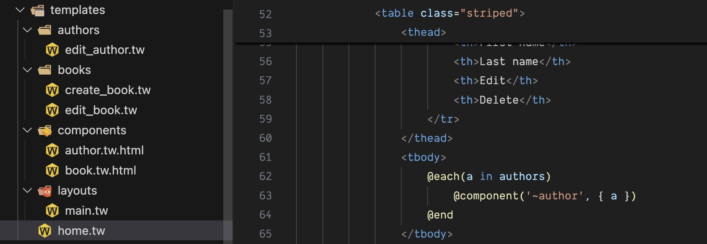

# Textwire Official

## Overview

The **Textwire VSCode Extension** is an open-source solution that enhances the development experience for the Textwire templating language. With features like syntax highlighting, custom file icons, and intelligent autocompletion, this extension makes working with Textwire files seamless and efficient.

## Features

### 1. Syntax Highlighting
Textwire files are visually enhanced with syntax highlighting for:
- Directives
- Comments
- Expressions
- Other key language elements

This ensures better readability and reduces the chances of syntax errors.

### 2. Custom File Icons
Quickly identify Textwire files in your VSCode file explorer with custom-designed icons. These icons provide a unique and recognizable appearance, improving project organization and file navigation.

## Installation
1. Open the **Extensions Marketplace** in VSCode.
2. Search for `Textwire`.
3. Click **Install**.
4. Enjoy enhanced support for Textwire files in your projects.

## Feedback
Have suggestions or questions? Feel free to open an issue on the [GitHub repository](https://github.com/textwire/vscode-textwire) or reach out to us directly.

## License
This project is licensed under the [MIT License](https://github.com/textwire/vscode-textwire/blob/main/LICENSE).